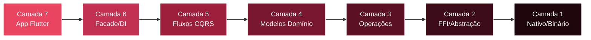

# D7 — Stack 7 Camadas

> **Tags:** `D7`
> **Data de verificacao:** 2026-06-07
> **Fonte canonica:** `drafts/reviews/truth.md`
> **Sintaxe Mermaid:** validada em 2026-06-07

> **Fonte:** Capítulo 3, Seção 3.2 — Arquitetura em Camadas do PluginCrypto
> **Padrões de projeto:** 9 (Singleton, Facade, Factory, Strategy, Builder, CQRS, Sealed Classes, Result, Adapter)
> **Subsistemas FFI:** 30 | **Funções FFI vinculadas:** ~189

---

## 1. Diagrama de Camadas (Top → Down)

```mermaid
flowchart TD
    subgraph L7["<b>Camada 7 — Aplicação (Topo)</b>"]
        APP["📱 <b>Aplicação Flutter</b><br/>tcc_test_app/<br/>── 6 abas (Material 3)<br/>── Info | Hash | AES | RSA<br/>    | ECDSA | X509/CMS<br/>── Consome PluginCrypto<br/>    via PluginCrypto.instance.api"]
    end

    subgraph L6["<b>Camada 6 — Facade &amp; Injeção de Dependência</b>"]
        FACADE["🏗️ <b>PluginCryptoAPI</b> (Singleton)<br/>plugin_crypto/lib/src/crypto/crypto_api.dart<br/>── 25 métodos públicos<br/>── Ponto único de entrada"]
        CTX["🧩 <b>CryptoContext</b> (DI)<br/>── Injeção de OpenSslBindings,<br/>    KeyCreatorFactory, Operations"]
    end

    subgraph L5["<b>Camada 5 — Fluxos (CQRS)</b>"]
        KCF["🏭 <b>KeyCreatorFactory</b><br/>Factory + Strategy<br/>── RSA | EC | ML-KEM | ML-DSA"]
        CB["🔧 <b>CertificateBuilder</b><br/>Builder Pattern<br/>── API fluente X.509 v3"]
        SFS["📄 <b>StreamingFileSigner</b><br/>── Assinatura via streaming BIO<br/>── Memória limitada por chunk"]
        CV["🔗 <b>OpensslChainVerifier</b><br/>── Verificação cadeia completa<br/>── folha → intermediárias → raiz"]
        OTHER_FLOWS["📋 <b>Demais Fluxos</b><br/>── SelfSignedCertCreator<br/>── CmsSigner / CmsVerifier<br/>── CrlVerifier / OcspVerifier<br/>── CsrGenerator<br/>── TimestampClient"]
    end

    subgraph L4["<b>Camada 4 — Modelos de Domínio</b>"]
        KEYSPEC["🔑 <b>KeySpec</b> (Sealed Class)<br/>── RsaKeySpec(bits)<br/>── EcKeySpec(curve)<br/>── MlKemKeySpec(paramSet)<br/>── MlDsaKeySpec(paramSet)"]
        RESULT["✅ <b>CryptoResult&lt;T&gt;</b> (Sealed)<br/>── CryptoSuccess&lt;T&gt;(value)<br/>── CryptoFailure&lt;T&gt;(error)"]
        ERROR["❌ <b>CryptoError</b> (Sealed — 12 subtipos)<br/>── KeygenError, CertificateError,<br/>    FileSigningError, ValidationError,<br/>    ChainValidationError, CrlError,<br/>    X509ExtensionError, OcspError,<br/>    Asn1Error, AesGcmAuthFailure,<br/>    CsrError, TimestampError"]
        DATA_MODELS["📦 <b>Modelos de Dados</b><br/>── CertificateData<br/>── DistinguishedName<br/>── SigningAlgorithm<br/>── ChainValidationResult<br/>── CrlInfo, Asn1Node"]
    end

    subgraph L3["<b>Camada 3 — Operações</b>"]
        CRYPTO_OPS["🔐 <b>CryptoOperations</b><br/>── Hash (SHA-256/512,<br/>    SHA3-256/512)<br/>── randomBytes()"]
        AES_OPS["🔒 <b>AesOperations</b><br/>── CBC (128/256)<br/>── GCM (128/256)<br/>── AAD + tag auth"]
        ASYM_OPS["🔏 <b>AsymmetricOperations</b><br/>── RSA KeyGen/Sign/Verify<br/>── EC KeyGen/Sign/Verify<br/>── RSA-OAEP Encrypt/Decrypt<br/>── ML-KEM Encaps/Decaps<br/>── ML-DSA Sign/Verify"]
        X509_OPS["📜 <b>X509Operations</b><br/>── parseX509Certificate<br/>── verifyX509Certificate<br/>── Extensões v3"]
        CMS_OPS["📮 <b>CmsOperations</b><br/>── cmsSign / cmsVerify<br/>── cmsEncrypt / cmsDecrypt<br/>── cmsSignCades (CAdES-BES)"]
    end

    subgraph L2["<b>Camada 2 — FFI / Abstração</b>"]
        BINDINGS["🔗 <b>OpenSslBindings</b><br/>~189 funções vinculadas<br/>── 30 subsistemas (FFI-01 a FFI-30)<br/>── 42 tipos opacos<br/>── ~2015 linhas de código"]
        LOADER["📂 <b>NativeLoader</b><br/>── loadCrypto(): DynamicLibrary<br/>── loadSsl(): DynamicLibrary<br/><br/>Linux: libcrypto.so.4 → .so → .so.3<br/>Android: libcrypto.so (jniLibs)<br/>iOS: DynamicLibrary.process()"]
        MEMORY["🧠 <b>Gerenciamento de Memória</b><br/>── calloc&lt;Uint8&gt;(size)<br/>── try/finally { calloc.free(ptr) }<br/>── CRYPTO_free p/ strings OpenSSL<br/>── Refcount: X509, EVP_PKEY<br/>── Sem vazamentos (leak_detected = false)"]
    end

    subgraph L1["<b>Camada 1 — Nativo / Binário</b>"]
        LINUX_BIN["🐧 <b>Linux x86_64</b><br/>libcrypto.so.4 (~7.0 MB)<br/>libssl.so.4 (~1.3 MB)<br/>── Compilado via ./Configure + make<br/>── OpenSSL 4.0.0 (enable-fips)<br/>── Bundled via CMake"]
        ANDROID_BIN["🤖 <b>Android (3 ABIs)</b><br/>libcrypto.so (~3.3 MB arm64)<br/>libssl.so (~0.7 MB arm64)<br/>── NDK clang -shared<br/>── jniLibs/{arm64,armeabi,x86_64}<br/>── OpenSSL 4.0.0 (enable-fips)"]
        IOS_BIN["🍎 <b>iOS</b><br/>Static linking<br/>── DynamicLibrary.process()<br/>── OpenSSL embedded no binary"]
    end

    L7 --> L6
    L6 --> L5
    L5 --> L4
    L4 --> L3
    L3 --> L2
    L2 --> L1

    style L7 fill:#1a1a2e,stroke:#e94560,color:#fff
    style L6 fill:#16213e,stroke:#e94560,color:#fff
    style L5 fill:#0f3460,stroke:#e94560,color:#fff
    style L4 fill:#533483,stroke:#e94560,color:#fff
    style L3 fill:#0f3460,stroke:#e94560,color:#fff
    style L2 fill:#16213e,stroke:#e94560,color:#fff
    style L1 fill:#1a1a2e,stroke:#e94560,color:#fff
```

---

## 2. Direção das Dependências

> **Regra de dependência:** Cada camada depende apenas das camadas inferiores (sentido top→down). Não há referências cíclicas ou dependências upward. A injeção de dependência na Camada 6 garante que os bindings FFI sejam criados uma única vez e propagados para baixo.

---

## 3. Padrões de Projeto por Camada

| Camada | Padrões Aplicados | Onde |
|---|---|---|
| **L6 — Facade/DI** | Singleton, Facade | `PluginCryptoAPI.instance` (singleton), `PluginCryptoAPI` (facade unificada) |
| **L5 — Fluxos CQRS** | Factory, Strategy, Builder, CQRS | `KeyCreatorFactory` (factory+strategy), `CertificateBuilder` (builder), KeyCreator (CQRS) |
| **L4 — Modelos** | Sealed Classes, Result | `KeySpec` hierarchy, `CryptoResult<T>` |
| **L3 — Operações** | Adapter | `PluginCryptoOperations` como ponte Dart↔C |
| **L2 — FFI** | Adapter | `OpenSslBindings` como adapter para C ABI |

---

## 4. Métricas da Camada FFI (Camada 2)

| Métrica | Valor | Fonte |
|---|---|---|
| **Subsistemas FFI** | **30** (FFI-01 a FFI-30) | `drafts/contexto.md:75-108` |
| **Funções FFI vinculadas** | **~189** | `plugin_crypto/lib/src/ffi/openssl_bindings.dart:1290-2014` |
| **Tipos opacos** | **42** | `openssl_bindings.dart:26-67` |
| **Linhas de código** | **2015** | `openssl_bindings.dart` |
| **Cobertura FFI** | **96,8%** (298/308) | `tcc_info/06-metrics-analysis-and-interpretation.md:465` |

---

## Notas

- A arquitetura em 7 camadas reflete a separação estrita de responsabilidades: apresentação (L7), API pública (L6), lógica de negócio criptográfica (L5), modelos (L4), operações (L3), abstração FFI (L2) e binários nativos (L1).
- O padrão **CQRS** (Command Query Responsibility Segregation) na Camada 5 separa criação de artefatos criptográficos (Commands) da verificação/consulta (Queries).
- O padrão **Result** (`CryptoResult<T>`) na Camada 4 substitui exceções para fluxos de mais alto nível, com 12 subtipos de erro selados que garantem correspondência exaustiva pelo compilador Dart.
- **Gerenciamento de memória determinístico:** toda alocação nativa (`calloc`) tem `calloc.free` em `finally` — sem dependência de GC. RSS delta máximo: 17,5 MB, sem vazamentos (`leak_detected = false`).
- **Testes comprovam a arquitetura:** 515 Linux + 177 Android = 692 testes totais, 0 falhas.
